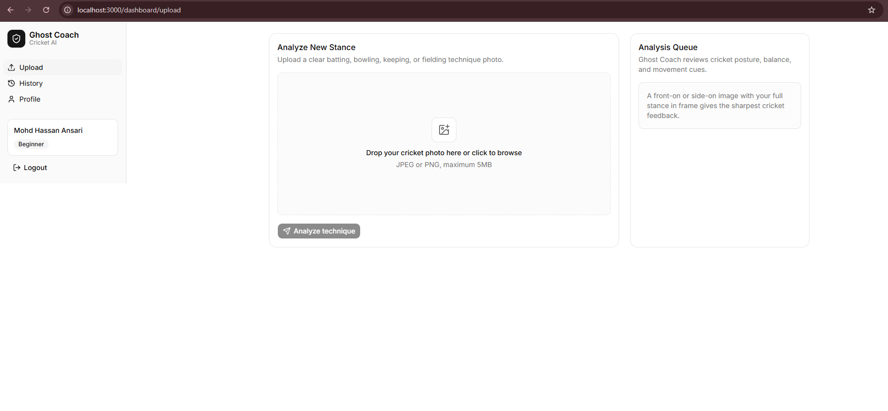

# 👻 Ghost Coach — AI-Powered Cricket Coaching Assistant

> A take-home assignment submission for Playmotech Engineering Interview  
> Built by **Mohd Hassan** · Role: Frontend / Full-Stack

---

## 📸 Screenshots

### Registration & Login
<!-- Add screenshot: /screenshots/register.png -->
)

### Upload & Analysis


### AI Coaching Report
<!-- Add screenshot: /screenshots/report.png -->
)

### Session History
<!-- Add screenshot: /screenshots/history.png -->
)

### AI Follow-up Chat
<!-- Add screenshot: /screenshots/chat.png -->
)

---

## 🚀 Getting Started

### Prerequisites

- Node.js 18+
- A NeonDB account (free) — [neon.tech](https://neon.tech)
- A Gemini API key (free) — [aistudio.google.com](https://aistudio.google.com)
- A Vercel account for Blob storage (free) — [vercel.com](https://vercel.com)

### Setup in under 5 minutes

**1. Clone the repository**

```bash
git clone https://github.com/mohd-hassan17/Ghost-coach.git
cd ghost-coach
```

**2. Install dependencies**

```bash
npm install
```

**3. Set up environment variables**

Create a `.env.local` file in the root:

```env
DATABASE_URL=your_neondb_connection_string
NEXTAUTH_SECRET=your_random_secret
NEXTAUTH_URL=http://localhost:3000
GEMINI_API_KEY=your_gemini_api_key
BLOB_READ_WRITE_TOKEN=your_vercel_blob_token
```

**4. Push the database schema**

```bash
npm run db:push
```

**5. Run the app**

```bash
npm run dev
```

Open [http://localhost:3000](http://localhost:3000) — you're good to go.

---

## 🏗️ Architecture

```
ghost-coach/
├── app/
│   ├── (auth)/
│   │   ├── login/          # Login page
│   │   └── register/       # Registration page
│   ├── dashboard/
│   │   ├── upload/         # Stance upload + AI analysis
│   │   ├── history/        # Session history grid
│   │   └── sessions/[id]/  # Full coaching report + chat
│   └── api/
│       ├── auth/           # NextAuth endpoints
│       ├── analyze/        # Image → Gemini Vision → structured feedback
│       ├── chat/           # Follow-up coaching chat
│       └── sessions/       # Session CRUD
├── src/
│   ├── db/
│   │   ├── schema.ts       # Drizzle schema (users, sessions, chatMessages)
│   │   └── index.ts        # NeonDB + Drizzle init
│   └── lib/
│       └── auth.ts         # NextAuth config
└── drizzle.config.ts
```

**Stack:**

| Layer | Choice | Why |
|---|---|---|
| Framework | Next.js 14 (App Router) | Full-stack in one repo, great DX |
| UI | Shadcn UI + Tailwind | Consistent, accessible components out of the box |
| Database | NeonDB (Postgres) | Serverless Postgres, generous free tier, perfect for Next.js |
| ORM | Drizzle | Type-safe, lightweight, great NeonDB integration |
| Auth | NextAuth.js | Industry standard, handles JWT + session management |
| Vision AI | Gemini 1.5 Flash | Free tier, fast, strong vision capability |
| Image Storage | Vercel Blob | Zero-config with Vercel deployment |

---

## 🤖 AI Prompt Design

The core of Ghost Coach is the Gemini Vision prompt. I spent significant time iterating on it before writing any UI.

**Key design decisions:**

**1. Strict JSON output**  
The prompt instructs Gemini to return only a JSON object with no preamble. This makes parsing reliable and eliminates markdown fence cleanup. If parsing fails, the API returns a 422 with a user-friendly error rather than crashing silently.

**2. Player context injected at runtime**  
Every analysis call passes the player's name, role (Batsman/Bowler etc.), and experience level into the prompt. A Beginner receives encouraging, plain-English feedback focused on one fix at a time. An Advanced player receives precise technical critique with cricket-specific terminology (bat swing path, elbow height, weight transfer, follow-through).

**3. Confidence level as a trust signal**  
If the uploaded image is blurry, too far away, or at an awkward angle, Gemini returns `"confidenceLevel": "Low"`. The UI displays this prominently so the player knows to re-upload a clearer photo rather than acting on unreliable feedback.

**4. Chat context window**  
The follow-up chat always includes the full coaching report (score, strengths, areasToImprove, priorityFix) as a system prompt prefix. This means the AI never gives generic answers — every response is grounded in that specific session.

---

## ✅ Features Built

- [x] Player registration with sport role and experience level
- [x] JWT-based authentication
- [x] Cricket stance photo upload (JPEG/PNG, max 5MB)
- [x] Gemini Vision analysis with structured 6-field coaching report
- [x] Session history with thumbnails, scores, and priority fixes
- [x] AI follow-up chat with session context
- [x] Progress score chart across sessions (recharts)
- [x] Mobile responsive design

---

## ⚠️ Known Limitations

| Limitation | How I'd address it with more time |
|---|---|
| No image annotation / body part callouts | Integrate a canvas overlay using Fabric.js, passing bounding box coordinates from Gemini's response |
| Sessions stored per user but not shareable | Add coach accounts with a coach–player relationship in the DB schema |
| Gemini occasionally returns malformed JSON on complex images | Add a retry with a stricter prompt + fallback structured extraction |
| No email verification on registration | Add Resend or Nodemailer for transactional email |
| Images stored publicly on Vercel Blob | Add signed URLs with expiry for privacy |

---

## 🔮 What I'd Build Next

**If this were a real product:**

1. **Video analysis** — Players upload a short clip of their bowling run-up or batting shot. Frame-by-frame analysis with Gemini Video would be far more useful than a single static photo.

2. **Coach dashboard** — Academy coaches get a view of all their players' sessions, can add their own text notes on top of the AI feedback, and track player progress over a season.

3. **Drill library** — Instead of one-off drill suggestions, build a structured library of drills tagged by skill and experience level. The AI recommends from the library rather than generating freeform text.

4. **Comparison mode** — Side-by-side view of two sessions so the player can visually see their improvement (or regression) over time.

5. **Push notifications** — Remind players to upload after practice, celebrate score improvements, flag when a player hasn't practiced in a week.

---

## 📬 Submission Details

- **Role applying for:** Frontend / Full-Stack  
- **GitHub:** [github.com/your-username/ghost-coach](https://github.com/your-username/ghost-coach)  
- **Loom walkthrough:** [loom.com/share/your-link-here](https://loom.com/share/your-link-here)

---

*Built with ☕ and cricket trivia by Mohd Hassan*